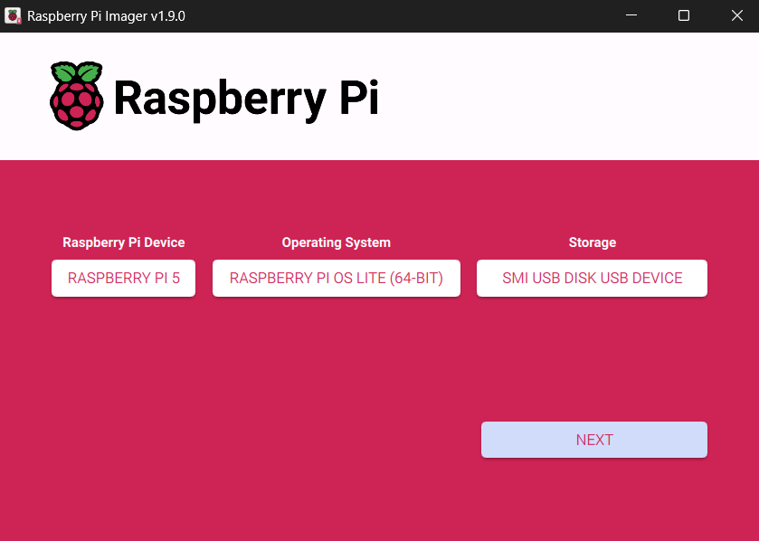
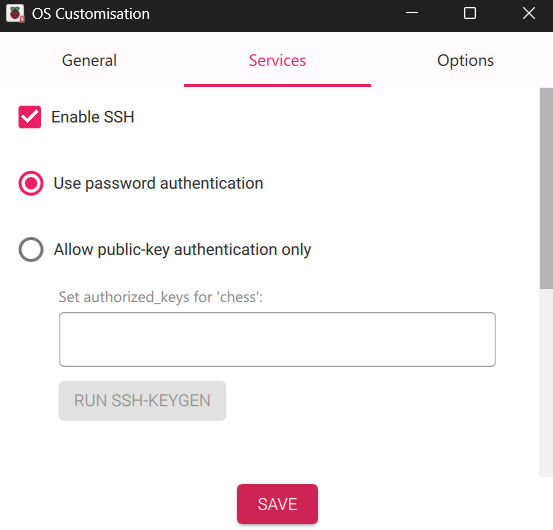

# Down with CHESS

## Introduction

This repository contains all of the files required to initialize a Raspberry Pi device as a local data logging platform. The breakdown shown within explains all steps required to install, initialize, manage, and deploy the aforementioned data logging platform. All files are included or pulled externally and are pre-configured for use as described within the following sections:

* Raspberry Pi preparation and OS setup
* Hardware preparation and setup
* Raspberry Pi program setup
* Program explanation and details
* Final considerations

## Raspberry Pi Preparation and OS Setup

Before starting this setup, you should have the following components on hand:

* Raspberry Pi
* SD Card
* Personal Computer with SSH enabled and the Raspberry Pi Imager software installed

Begin by inserting the SD card into your personal computer and starting the Raspberry Pi Imager software. Upon startup, you may select your respective Raspberry Pi Model and preferred operating system. All testing was performed on a Raspberry Pi Model 5 using the 64-bit Debian-based Raspberry Pi OS Lite distribution as seen below.

Upon selecting the "NEXT" prompt, the user will be asked if they would like to configure custom OS settings. Select the "EDIT SETTINGS" prompt and enable SSH under the "Services" tab as shown below.

You may now select "SAVE" and subsequently "YES" and continue with the installation as per the on-screen instructions. Upon successful imaging, you may remove the SD card from your personal computer and insert it into the Raspberry Pi for use.

## Secondary Hardware Preparation and Setup

You may now prepare the following hardware for usage:

* Arduino microcontroller with connected temperature sensors and servo motor
* Local Network source (router, local hotspot, etc.)

This setup was performed using an Arduino Mega microcontroller. All network interfacing was performed through a local network provided by a common household router.

## Raspberry Pi Program Setup

Copy and pase the following command into the command terminal for the Raspberry Pi

apt update && apt upgrade -y && apt install -y sudo curl git dos2unix python3 wpasupplicant && git clone https://github.com/Varyngoth/downwithchess && cd downwithchess && python3 eduroam.py && dos2unix setup.sh && chmod +x setup.sh && bash setup.sh
